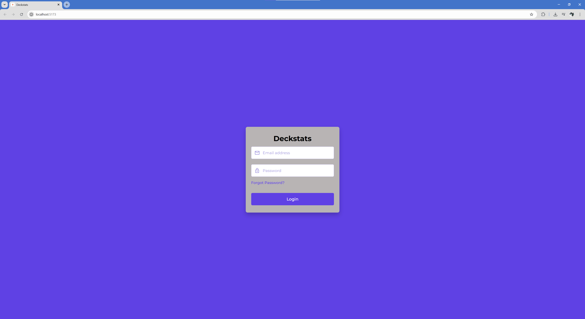
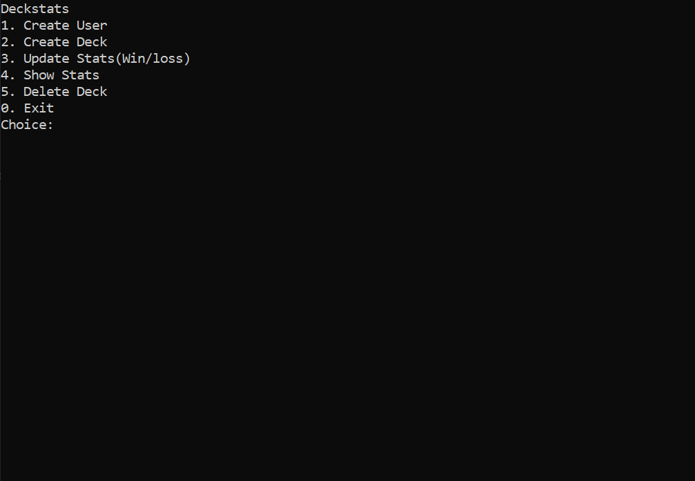

# Deck Stats 2.0 (Work in Progress)

Detta projekt är en vidareutveckling av mitt tidigare Deck Stats-projekt där statistiken nu lagras i en databas och exponeras via ett API.

Projektet började som ett konsolprogram byggt i C# och SQLite för att uppfylla en skoluppgift där applikationen skulle skapa och hantera en relationsdatabas. Programmet låter användare registrera konton, skapa lekar och registrera matchresultat.

Senare utvecklades projektet vidare med ett REST API i C#. En React-frontend påbörjades också för att ge projektet ett grafiskt gränssnitt och samtidigt ge mig möjlighet att prova ett annat frontend-ramverk än Angular, som jag använde i Duck Drive-projektet.

## Funktioner

* skapa användare med unik e-post
* lösenord lagras som hash
* skapa och hantera lekar kopplade till användare
* registrera vinster och förluster
* beräkna matcher, vinster, förluster och winrate
* REST API för att exponera data


## Arkitektur
```
React Frontend
↓
C# REST API
↓
SQLite Database
```
## Teknologier
* C#
* .NET
* SQLite
* REST API
* React

## Användning (konsolapplikation)

I nuläget används projektet främst via konsolapplikationen.


Via konsolen kan man:

- skapa nya användare
- registrera lekar kopplade till en användare
- uppdatera vinster och förluster
- hämta statistik över matcher och winrate

### Exempel
Skapa användare

Email: user@example.com

Password: ********

Skapa lek

Deck name: Testlek

Registrera match
Result: Win

## Köra projektet

Backend och frontend körs separat.

### Starta backend

Navigera till backend-projektet och kör:

```
dotnet run
```

### Starta frontend

Navigera till frontend-mappen och kör:
```
npm install
npm run dev
```

## Status

Detta projekt är fortfarande under utveckling.

Backend och databaslogik är implementerade och kan användas via konsolapplikationen. React-frontend är påbörjad och innehåller i nuläget inloggning, men konto måste först skapas via konsolversionen.

### Frontend

- [x] login
- [ ] skapa konto via frontend
- [ ] skapa/visa lekar
- [ ] registrera matchresultat
- [ ] visa statistik

